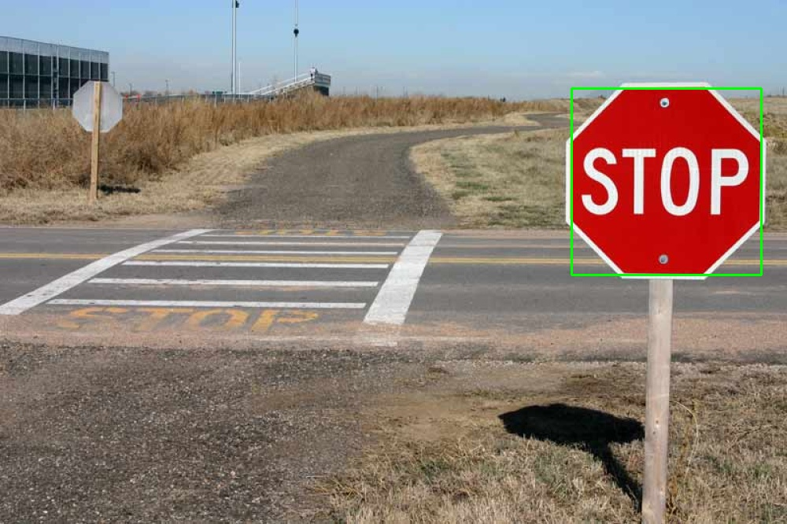
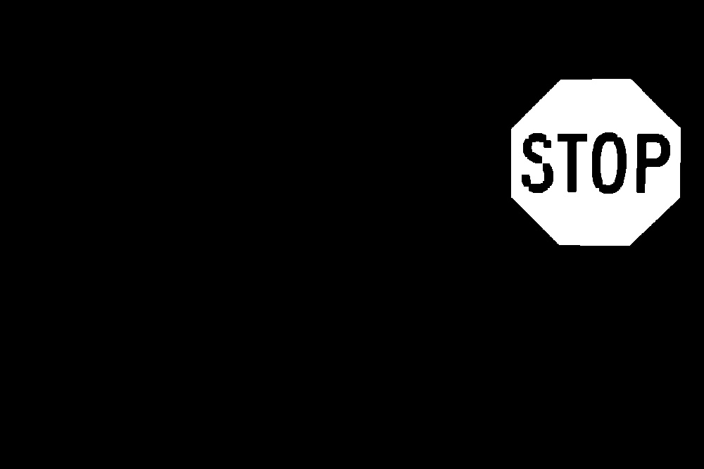
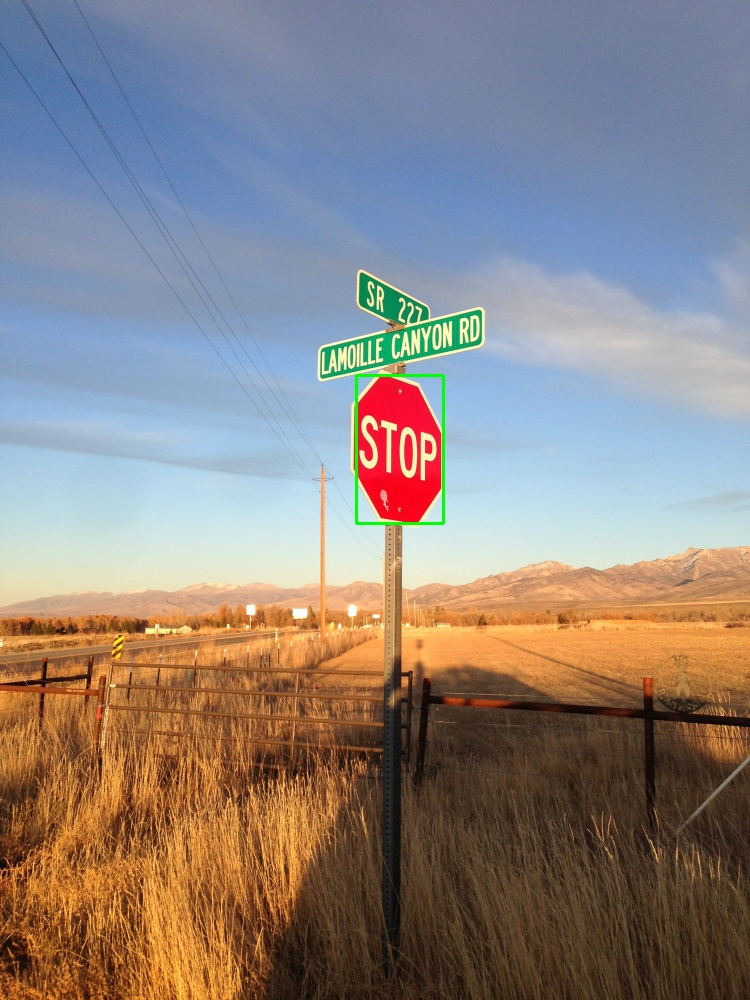
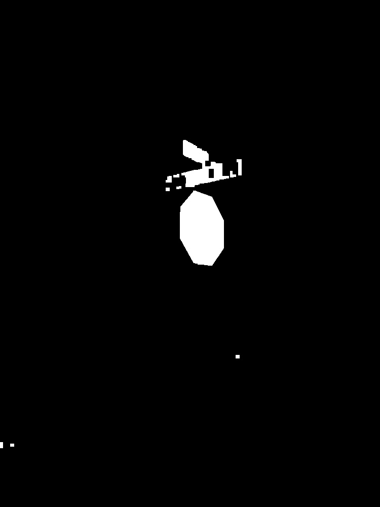
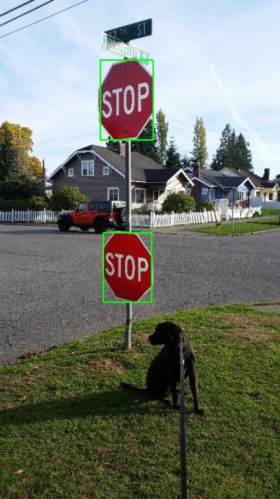
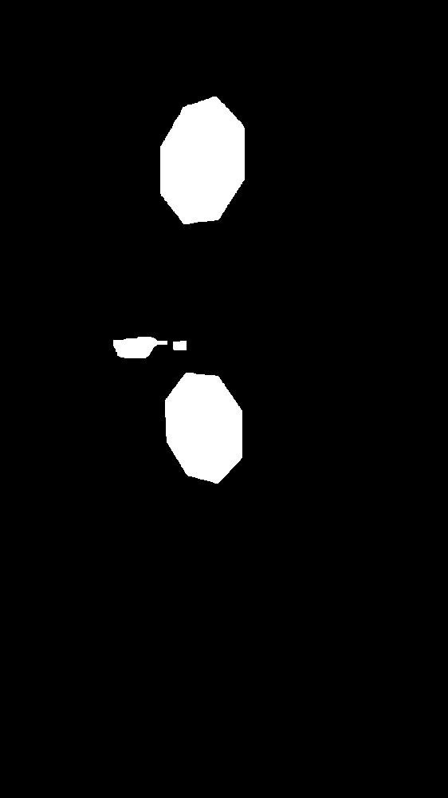
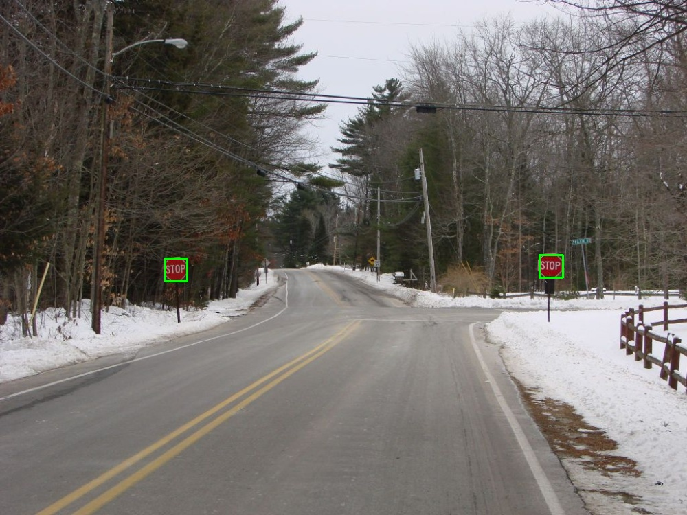
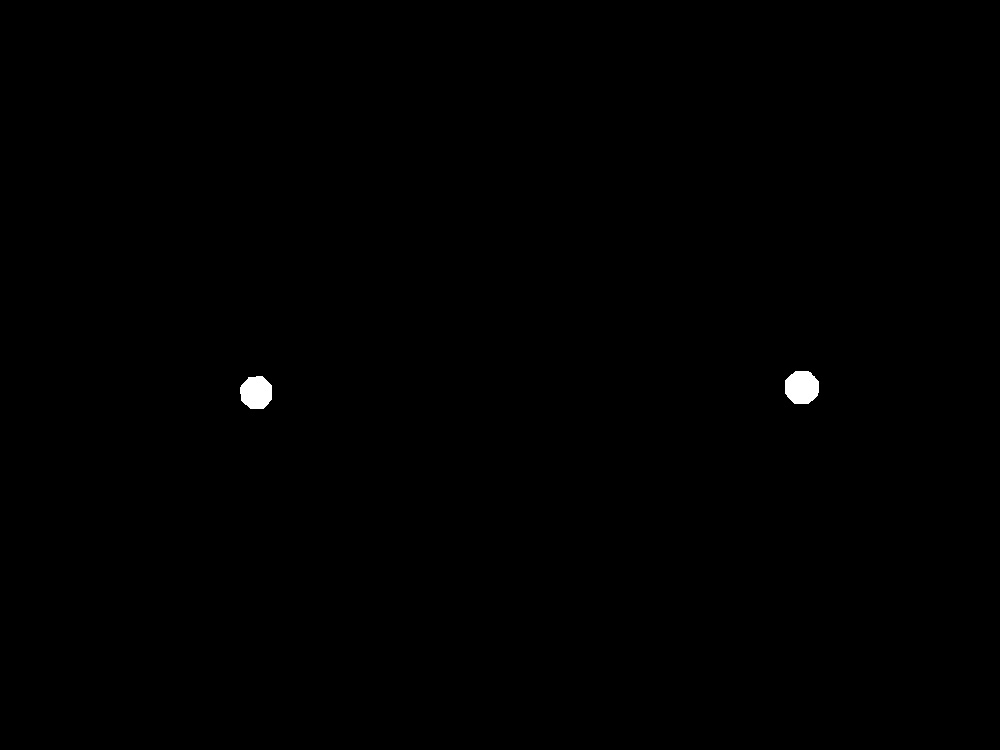

# Stop Sign Detector

Image color segmentation is a common and important topic. With the technique in computer vision and machine learning, we can find the properties of a given image. Furthermore, we can find areas with the same textures and approach the detection problem. In this project, the object is to segment the stop sign out of given images. This problem is important for self-driving cars to decide whether they should stop at the cross.

In this project, we design an algorithm to detect stop sign. We apply the Gaussian naive Bayes to segment unknown images, detect stop signs in an image, and draw bounding boxes. Firstly, we labeled the 200 training images and trained Gaussian models in RGB and YCbCr color spaces for image segmentation. Secondly, I processed segmented images by morphology operations (closing and opening) to remove noises. Lastly, I designed a method based on the Euler characteristic, the aspect ratio, and area proportion to score the similaritybetween regions in segmented images and a stop sign shape.

## Project Report
[Sheng-Wei Chang. "Stop Sign Detector" 02 Feb. 2020. ECE 276A, UCSD, Student Paper](/stop_sign_detector.pdf)

## Results
<table>
  <tr>
    <td align="center"><b>Stop Sign Detection</b></td>
    <td align="center"><b>Color Segmention</b></td>
  </tr>
  <tr>
    <td> </td>
    <td> </td>
   </tr> 
   <tr>
    <td> </td>
    <td> </td>
  </tr>
  <tr>
    <td> </td>
    <td> </td>
  </tr>
  <tr>
    <td> </td>
    <td> </td>
  </tr>
</table>
